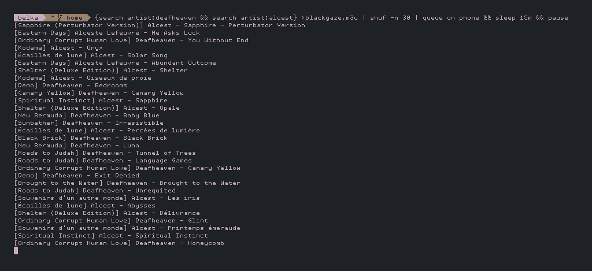
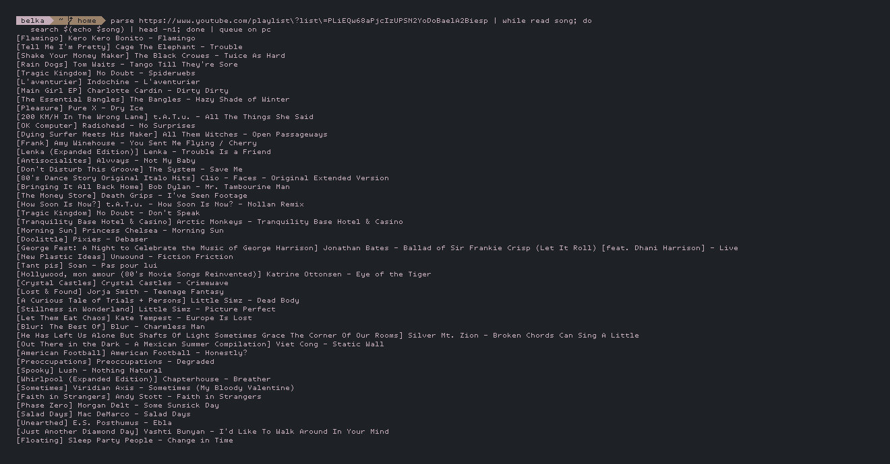

## Spotify-Headless
CLI tool using [puppeteer](https://github.com/puppeteer/puppeteer) to intercept your OAuth-validated Spotify token (alongside of the session cookies), then reinject them to imitate an authorized, User-like traffic. It works as a wrapper around Spotify's web API.
#### How it works
1. Establish a secure session by authenticating to Spotify within a headless browser. (Puppeteer)<br><del>2. Generate a valid Json Web Token and use it until expiration.</del> <br> <del>3. Start over.</strike> <br>
2. Export the session cookies and store them locally, specifically the refresh token that continually validates the access token throughout its lifespan.
3. The access token allows you to perform special actions on behalf of a user, once expired, it's updated by the refresh token.
4. The first two steps must be repeated once the refresh token expires. (after one year).

#### Installation and configuration
```bash
git clone https://github.com/BelkaDev/Spotify-JWT ~/Spotify-JWT
cd ~/Spotify-JWT && npm i
```
To provide your credentials you need to set them as environement variables within your .bashrc (respectively your shell config file) <br>
``` bash
export SPOTIFY_USER=""
export SPOTIFY_PWD=""
```
#### Running
Manually grab your access token: `node token.js` <br>
Other commands are found under `/lib` folder, they are simple and pretty straightforward on their own.

#### Use case
The sole purpose is to combine aliases into automated and complex tasks, this can offer a lot of flexibility as shown below:
###### <u> example 1 (Basic):  </u>: Browse Spotify catalog, filter items, feed STDOUT to queue.

###### <u> example 2 (Advanced) </u>: Store to a local playlist, shuffle songs, set a timer, transfer ongoing stream to your mobile device.

###### <u> example 3 (Expert):  </u>: Convert Youtube playlist to a Spotify playlist.



#### Notes:
`play.js` reads input from stdin only
`transfer.js` takes `phone/mobile`,`computer/pc`,`browser` as parameters, if the suggested device isn't opened, it sends the signal to the actual active device (in other words it does nothing) </br>
`search.js` will lookup for tracks by default, unlike other items (albums,playlists etc..), tracks can be stacked and enqueued at once, more details [here](https://developer.spotify.com/documentation/web-api/reference/player/start-a-users-playback/) </br>
you can pass `album`,`artist`,`playlist` as the arguments.
